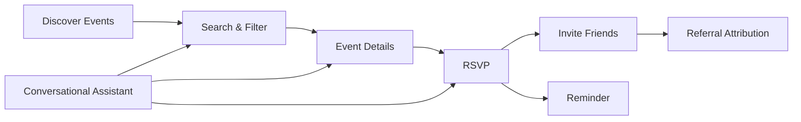
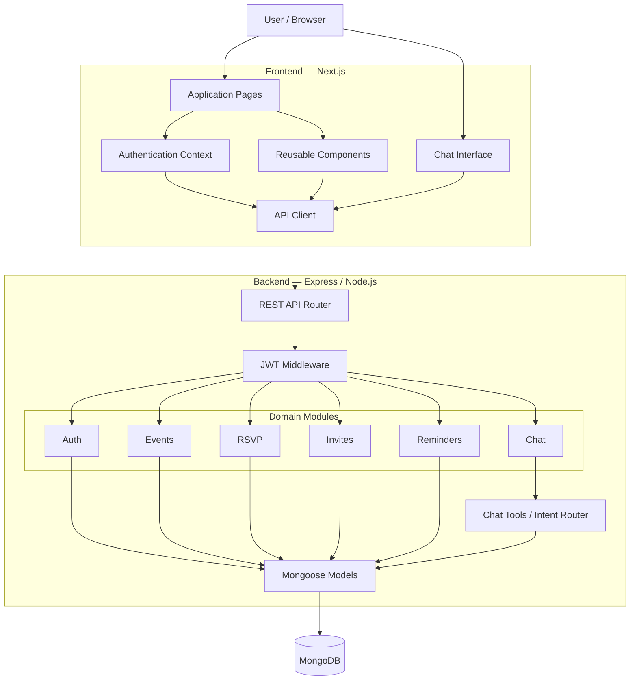

# Intelli-Chat — EventFlow

<p align="center">

### AI-Assisted Event Discovery, Planning & Social Engagement Platform

A production-oriented full-stack TypeScript application for discovering events, managing RSVPs, inviting friends, tracking referrals, creating reminders, and interacting with events through a conversational assistant.

<p align="center">
  
  
  
  
  
  
  
  
</p>

---

## 📌 Table of Contents

* [Overview](#-overview)
* [Problem Statement](#-problem-statement)
* [Solution](#-solution)
* [Key Features](#-key-features)
* [System Architecture](#-system-architecture)
* [High-Level Architecture Diagram](#-high-level-architecture-diagram)
* [Frontend Architecture](#-frontend-architecture)
* [Backend Architecture](#-backend-architecture)
* [Database Architecture](#-database-architecture)
* [Authentication Flow](#-authentication-flow)
* [Event Discovery Flow](#-event-discovery-flow)
* [RSVP Flow](#-rsvp-flow)
* [Invite & Referral Flow](#-invite--referral-flow)
* [Reminder Flow](#-reminder-flow)
* [Conversational Assistant Architecture](#-conversational-assistant-architecture)
* [Complete User Journey](#-complete-user-journey)
* [Repository Structure](#-repository-structure)
* [Technology Stack](#-technology-stack)
* [Data Model](#-data-model)
* [API Documentation](#-api-documentation)
* [Environment Variables](#-environment-variables)
* [Local Development](#-local-development)
* [Build & Validation](#-build--validation)
* [Security](#-security)
* [Production Architecture](#-production-architecture)
* [Testing Strategy](#-testing-strategy)
* [Known Limitations](#-known-limitations)
* [Roadmap](#-roadmap)
* [Contributing](#-contributing)
* [Author](#-author)

---

# 🚀 Overview

**EventFlow** is a full-stack event discovery and social planning platform.

The application combines:

* Event discovery
* Search and filtering
* Event details
* RSVP management
* Friend invitations
* Referral attribution
* Reminder management
* Conversational event search
* Persistent chat conversations
* JWT-based authentication

The project is designed as a **TypeScript monorepo**, separating frontend, backend, and shared code for maintainability and scalability.

---

# 🎯 Problem Statement

Finding and attending events often involves several disconnected workflows:

```text
Search Event
     ↓
Open Event Website
     ↓
Check Details
     ↓
Decide Whether to Attend
     ↓
RSVP
     ↓
Invite Friends
     ↓
Remember Event
```

EventFlow consolidates these actions into a single platform.

The goal is to provide a unified workflow:

```text
Discover → Understand → RSVP → Invite → Track → Attend
```

---

# 💡 Solution

EventFlow provides an integrated event lifecycle:



---

# ✨ Key Features

## 🔐 Authentication

* User registration
* User login
* Password hashing using bcrypt
* JWT authentication
* Protected API routes
* Current-user endpoint

## 🔎 Event Discovery

* Keyword search
* Category filtering
* City filtering
* Date filtering
* Pagination
* Calendar-based browsing
* Event detail pages
* External ticket links

## 🎟️ RSVP Management

* RSVP to an event
* Cancel RSVP
* Re-confirm RSVP
* View personal events
* Prevent duplicate RSVPs

## 👥 Social Invites

* Generate event-specific invite links
* Share invite URLs
* Track invite clicks
* Attribute RSVPs to referring users
* View invite statistics
* Prevent self-referral

## ⏰ Reminders

* Create event reminders
* Retrieve pending reminders
* Store reminder metadata

## 🤖 Conversational Event Assistant

The application provides a conversational interface for event-related queries.

Current capabilities include:

* Event search
* Event retrieval
* Personal RSVP lookup
* Conversation persistence
* Tool-oriented event operations
* Event cards in chat responses

> **Current implementation note:** the assistant backend currently uses deterministic intent classification and internal database tools. The repository contains configuration for future LLM integration, but the current implementation does not invoke an external LLM provider.

---

# 🏗️ System Architecture

EventFlow follows a layered architecture:

```text
┌────────────────────────────────────────────────────────────┐
│                        USER / BROWSER                       │
└───────────────────────────┬────────────────────────────────┘
                            │
                            ▼
┌────────────────────────────────────────────────────────────┐
│                     NEXT.JS FRONTEND                       │
│                                                            │
│  Pages • Components • Auth Context • API Client • Chat UI │
└───────────────────────────┬────────────────────────────────┘
                            │ HTTP / REST
                            ▼
┌────────────────────────────────────────────────────────────┐
│                     EXPRESS API                            │
│                                                            │
│  Routes → Middleware → Modules → Services → Models        │
└───────────────────────────┬────────────────────────────────┘
                            │
              ┌─────────────┴──────────────┐
              ▼                            ▼
┌───────────────────────────┐  ┌────────────────────────────┐
│     BUSINESS MODULES      │  │      CHAT / TOOL LAYER     │
│                           │  │                            │
│ Auth • Events • RSVP      │  │ Intent Classification      │
│ Invites • Reminders       │  │ Tool Execution             │
└──────────────┬────────────┘  └─────────────┬──────────────┘
               │                             │
               └──────────────┬──────────────┘
                              ▼
                 ┌─────────────────────────┐
                 │      MONGODB            │
                 │                         │
                 │ Users • Events • RSVPs │
                 │ Invites • Reminders   │
                 │ Conversations • Chat  │
                 └─────────────────────────┘
```

---

# 🔷 High-Level Architecture Diagram



---

# 🎨 Frontend Architecture

The frontend is built using **Next.js + React + TypeScript**.

```text
                  ┌─────────────────────┐
                  │     Next.js App     │
                  └──────────┬──────────┘
                             │
        ┌────────────────────┼─────────────────────┐
        ▼                    ▼                     ▼
   Authentication       Event Discovery        Chat UI
        │                    │                     │
        ▼                    ▼                     ▼
   AuthContext          Event Components      Conversations
        │                    │                     │
        └────────────────────┼─────────────────────┘
                             ▼
                       API Client
                             │
                             ▼
                      Express Backend
```

### Frontend Responsibilities

* Route rendering
* UI state
* Authentication state
* Event browsing
* RSVP interactions
* Calendar visualization
* Invite workflows
* Chat experience
* API communication

### Main Routes

| Route              | Purpose                    |
| ------------------ | -------------------------- |
| `/`                | Event discovery            |
| `/events`          | Event search and filtering |
| `/events/:id`      | Event details              |
| `/calendar`        | Calendar                   |
| `/chat`            | Conversational assistant   |
| `/invite/:token`   | Invite acceptance          |
| `/dashboard/rsvps` | User's RSVPs               |
| `/profile`         | User profile               |
| `/login`           | Authentication             |
| `/register`        | Registration               |

---

# ⚙️ Backend Architecture

The backend follows a module-based architecture.

```text
Request
   │
   ▼
Express Router
   │
   ▼
Middleware
   │
   ├── CO
```

