# Intelli-Chat — EventFlow

<p align="center">

### AI-Assisted Event Discovery, Planning & Social Engagement Platform

A production-oriented full-stack TypeScript application for discovering events, managing RSVPs, inviting friends, tracking referrals, creating reminders, and interacting with events through a conversational assistant.

<p align="center">
  
  
  
  
  
  
  
  
</p>

---

## 📌 Table of Contents

* [Overview](#-overview)
* [Problem Statement](#-problem-statement)
* [Solution](#-solution)
* [Key Features](#-key-features)
* [System Architecture](#-system-architecture)
* [High-Level Architecture Diagram](#-high-level-architecture-diagram)
* [Frontend Architecture](#-frontend-architecture)
* [Backend Architecture](#-backend-architecture)
* [Database Architecture](#-database-architecture)
* [Authentication Flow](#-authentication-flow)
* [Event Discovery Flow](#-event-discovery-flow)
* [RSVP Flow](#-rsvp-flow)
* [Invite & Referral Flow](#-invite--referral-flow)
* [Reminder Flow](#-reminder-flow)
* [Conversational Assistant Architecture](#-conversational-assistant-architecture)
* [Complete User Journey](#-complete-user-journey)
* [Repository Structure](#-repository-structure)
* [Technology Stack](#-technology-stack)
* [Data Model](#-data-model)
* [API Documentation](#-api-documentation)
* [Environment Variables](#-environment-variables)
* [Local Development](#-local-development)
* [Build & Validation](#-build--validation)
* [Security](#-security)
* [Production Architecture](#-production-architecture)
* [Testing Strategy](#-testing-strategy)
* [Known Limitations](#-known-limitations)
* [Roadmap](#-roadmap)
* [Contributing](#-contributing)
* [Author](#-author)

---

# 🚀 Overview

**EventFlow** is a full-stack event discovery and social planning platform.

The application combines:

* Event discovery
* Search and filtering
* Event details
* RSVP management
* Friend invitations
* Referral attribution
* Reminder management
* Conversational event search
* Persistent chat conversations
* JWT-based authentication

The project is designed as a **TypeScript monorepo**, separating frontend, backend, and shared code for maintainability and scalability.

---

# 🎯 Problem Statement

Finding and attending events often involves several disconnected workflows:

```text
Search Event
     ↓
Open Event Website
     ↓
Check Details
     ↓
Decide Whether to Attend
     ↓
RSVP
     ↓
Invite Friends
     ↓
Remember Event
```

EventFlow consolidates these actions into a single platform.

The goal is to provide a unified workflow:

```text
Discover → Understand → RSVP → Invite → Track → Attend
```

---

# 💡 Solution

EventFlow provides an integrated event lifecycle:

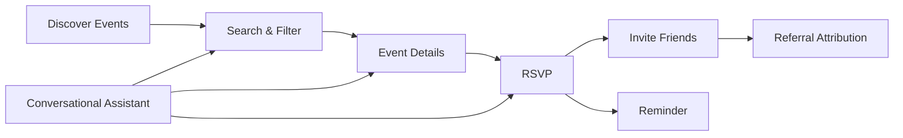

---

# ✨ Key Features

## 🔐 Authentication

* User registration
* User login
* Password hashing using bcrypt
* JWT authentication
* Protected API routes
* Current-user endpoint

## 🔎 Event Discovery

* Keyword search
* Category filtering
* City filtering
* Date filtering
* Pagination
* Calendar-based browsing
* Event detail pages
* External ticket links

## 🎟️ RSVP Management

* RSVP to an event
* Cancel RSVP
* Re-confirm RSVP
* View personal events
* Prevent duplicate RSVPs

## 👥 Social Invites

* Generate event-specific invite links
* Share invite URLs
* Track invite clicks
* Attribute RSVPs to referring users
* View invite statistics
* Prevent self-referral

## ⏰ Reminders

* Create event reminders
* Retrieve pending reminders
* Store reminder metadata

## 🤖 Conversational Event Assistant

The application provides a conversational interface for event-related queries.

Current capabilities include:

* Event search
* Event retrieval
* Personal RSVP lookup
* Conversation persistence
* Tool-oriented event operations
* Event cards in chat responses

> **Current implementation note:** the assistant backend currently uses deterministic intent classification and internal database tools. The repository contains configuration for future LLM integration, but the current implementation does not invoke an external LLM provider.

---

# 🏗️ System Architecture

EventFlow follows a layered architecture:

```text
┌────────────────────────────────────────────────────────────┐
│                        USER / BROWSER                       │
└───────────────────────────┬────────────────────────────────┘
                            │
                            ▼
┌────────────────────────────────────────────────────────────┐
│                     NEXT.JS FRONTEND                       │
│                                                            │
│  Pages • Components • Auth Context • API Client • Chat UI │
└───────────────────────────┬────────────────────────────────┘
                            │ HTTP / REST
                            ▼
┌────────────────────────────────────────────────────────────┐
│                     EXPRESS API                            │
│                                                            │
│  Routes → Middleware → Modules → Services → Models        │
└───────────────────────────┬────────────────────────────────┘
                            │
              ┌─────────────┴──────────────┐
              ▼                            ▼
┌───────────────────────────┐  ┌────────────────────────────┐
│     BUSINESS MODULES      │  │      CHAT / TOOL LAYER     │
│                           │  │                            │
│ Auth • Events • RSVP      │  │ Intent Classification      │
│ Invites • Reminders       │  │ Tool Execution             │
└──────────────┬────────────┘  └─────────────┬──────────────┘
               │                             │
               └──────────────┬──────────────┘
                              ▼
                 ┌─────────────────────────┐
                 │      MONGODB            │
                 │                         │
                 │ Users • Events • RSVPs │
                 │ Invites • Reminders   │
                 │ Conversations • Chat  │
                 └─────────────────────────┘
```

---

# 🔷 High-Level Architecture Diagram

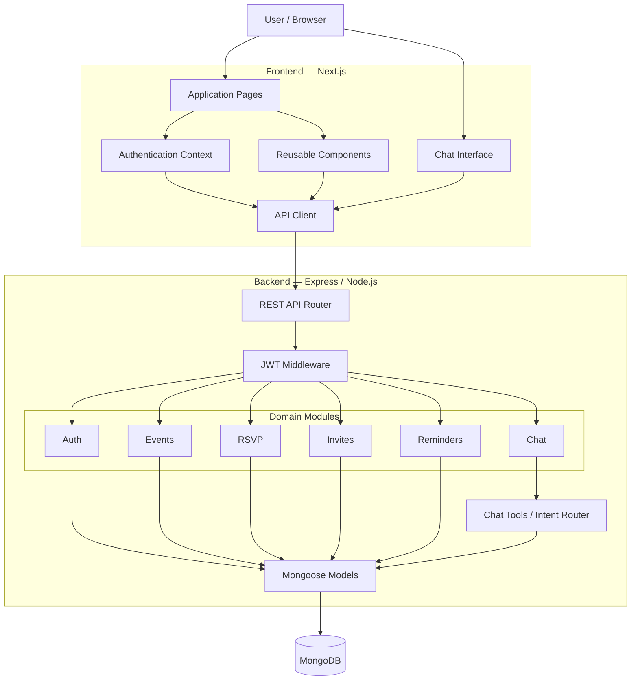

---

# 🎨 Frontend Architecture

The frontend is built using **Next.js + React + TypeScript**.

```text
                  ┌─────────────────────┐
                  │     Next.js App     │
                  └──────────┬──────────┘
                             │
        ┌────────────────────┼─────────────────────┐
        ▼                    ▼                     ▼
   Authentication       Event Discovery        Chat UI
        │                    │                     │
        ▼                    ▼                     ▼
   AuthContext          Event Components      Conversations
        │                    │                     │
        └────────────────────┼─────────────────────┘
                             ▼
                       API Client
                             │
                             ▼
                      Express Backend
```

### Frontend Responsibilities

* Route rendering
* UI state
* Authentication state
* Event browsing
* RSVP interactions
* Calendar visualization
* Invite workflows
* Chat experience
* API communication

### Main Routes

| Route              | Purpose                    |
| ------------------ | -------------------------- |
| `/`                | Event discovery            |
| `/events`          | Event search and filtering |
| `/events/:id`      | Event details              |
| `/calendar`        | Calendar                   |
| `/chat`            | Conversational assistant   |
| `/invite/:token`   | Invite acceptance          |
| `/dashboard/rsvps` | User's RSVPs               |
| `/profile`         | User profile               |
| `/login`           | Authentication             |
| `/register`        | Registration               |

---

# ⚙️ Backend Architecture

The backend follows a module-based architecture.

```text
Request
   │
   ▼
Express Router
   │
   ▼
Middleware
   │
   ├── CORS
   └── JWT Authentication
   │
   ▼
Domain Module
   │
   ├── Validation
   ├── Business Logic
   └── Database Operations
   │
   ▼
Mongoose Model
   │
   ▼
MongoDB
```

### Backend Modules

```text
apps/api/src/modules/

├── auth/
├── events/
├── rsvp/
├── invites/
├── reminders/
└── chat/
```

Each module owns a focused business responsibility.

This structure makes the system easier to:

* Maintain
* Test
* Extend
* Debug
* Scale across teams

---

# 🗄️ Database Architecture

MongoDB is used as the primary persistence layer.

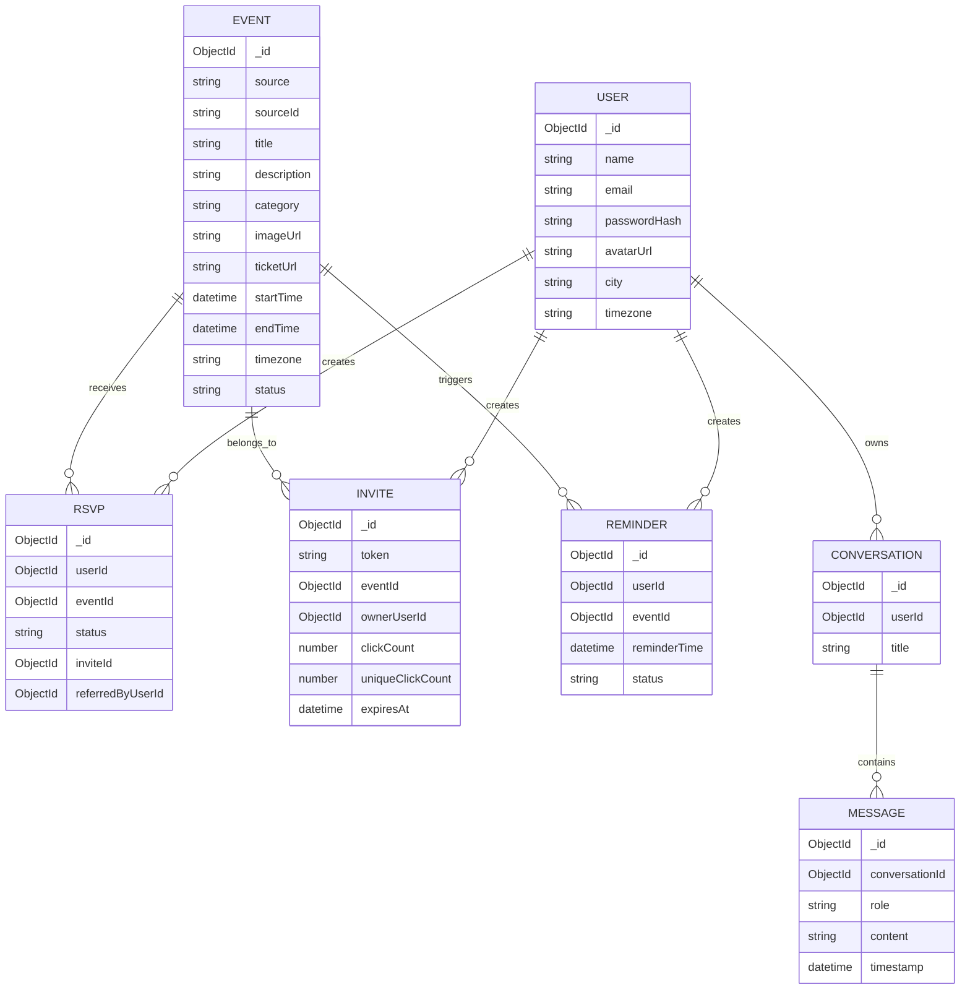

---

# 🔐 Authentication Flow

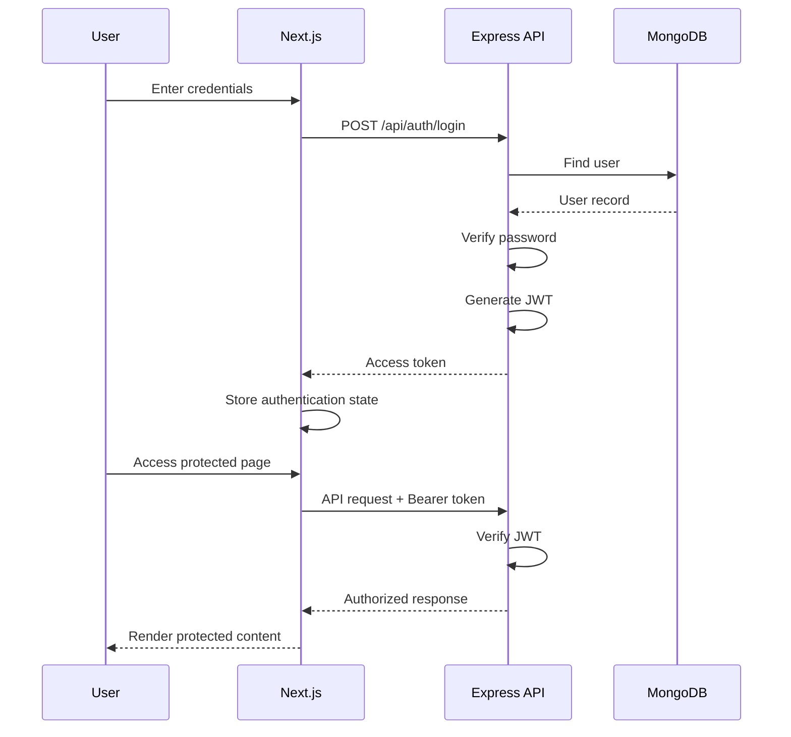

---

# 🔎 Event Discovery Flow

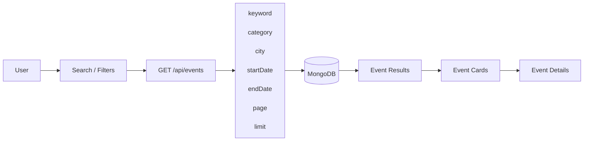

---

# 🎟️ RSVP Flow

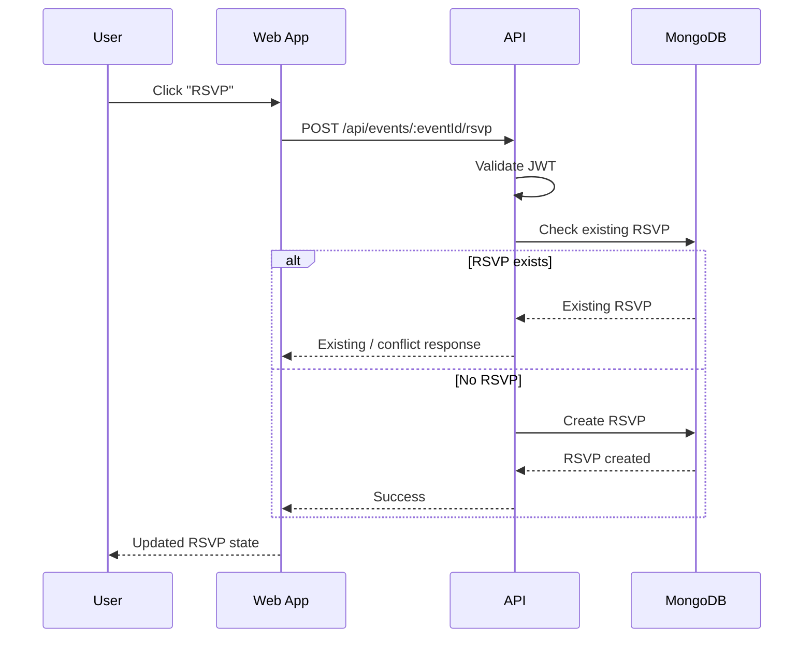

### RSVP State

```text
                    ┌─────────────┐
                    │   NONE      │
                    └──────┬──────┘
                           │ RSVP
                           ▼
                    ┌─────────────┐
                    │ CONFIRMED   │
                    └──────┬──────┘
                           │ Cancel
                           ▼
                    ┌─────────────┐
                    │ CANCELLED   │
                    └──────┬──────┘
                           │ Re-confirm
                           ▼
                    ┌─────────────┐
                    │ CONFIRMED   │
                    └─────────────┘
```

---

# 👥 Invite & Referral Flow

EventFlow supports invite-based RSVP attribution.

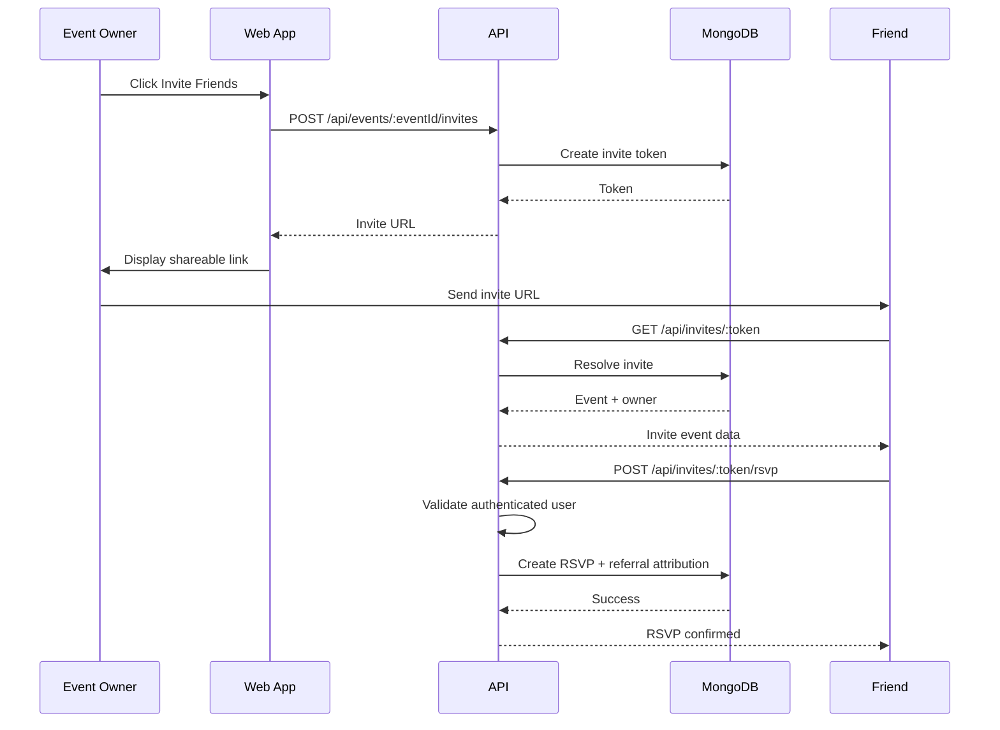

### Referral Relationship

```text
Event Owner
    │
    │ creates invite
    ▼
Invite Token
    │
    │ shared with friend
    ▼
Friend opens invite
    │
    │ RSVP
    ▼
RSVP
    │
    ├── eventId
    ├── userId
    ├── inviteId
    └── referredByUserId
```

This allows the platform to preserve **who invited whom to which event**.

---

# ⏰ Reminder Flow

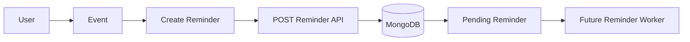

> The current implementation persists reminders and exposes pending-reminder retrieval. A production worker/queue should be added to automatically deliver notifications.

Recommended production architecture:

```text
MongoDB
   ↓
Reminder Scheduler
   ↓
Message Queue
   ↓
Notification Worker
   ├── Email
   ├── Push
   └── In-App
```

---

# 🤖 Conversational Assistant Architecture

The application provides a chat interface for event-oriented queries.

## Current Architecture

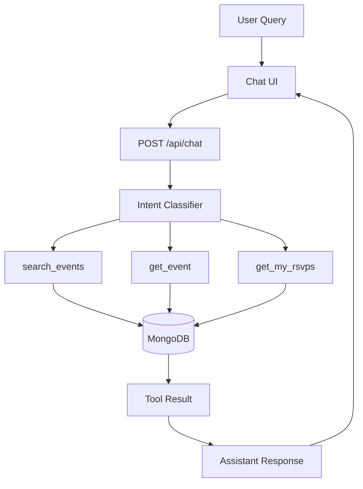

## Tool Layer

```text
search_events()
        │
        └── Search database events

get_event()
        │
        └── Retrieve event details

get_my_rsvps()
        │
        └── Retrieve current user's RSVPs
```

## Example Conversation

```text
User:
"Find music events in New York"

        ↓

Intent Classification

        ↓

search_events()

        ↓

MongoDB

        ↓

Matching Events

        ↓

Assistant Response

        ↓

Event Cards
```

---

# 🧠 Future LLM Architecture

The current tool layer can evolve into a true LLM-based agent architecture.

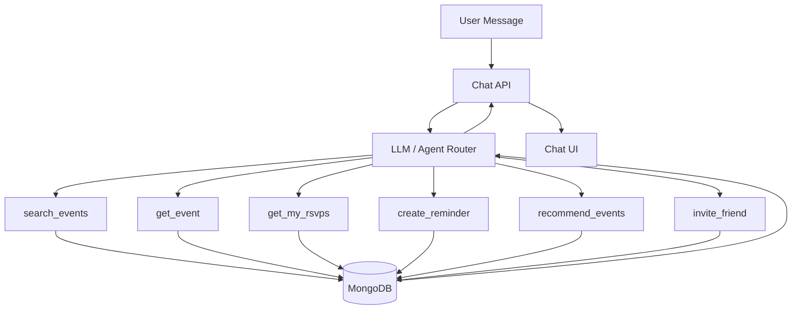

This architecture separates:

```text
LLM reasoning
      +
Tool execution
      +
Business logic
      +
Database
```

which provides a cleaner path toward production-grade agent functionality.

---

# 🔄 Complete User Journey

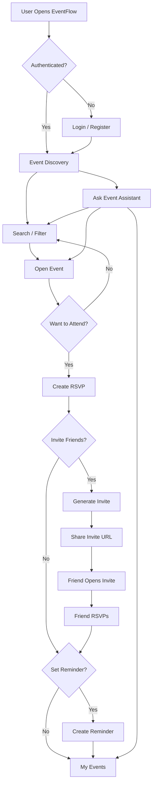

---

# 📁 Repository Structure

```text
Intelli-Chat/
│
├── apps/
│   │
│   ├── web/                         # Next.js frontend
│   │   ├── src/
│   │   │   ├── app/
│   │   │   │   ├── page.tsx
│   │   │   │   ├── events/
│   │   │   │   ├── calendar/
│   │   │   │   ├── chat/
│   │   │   │   ├── invite/
│   │   │   │   ├── dashboard/
│   │   │   │   ├── profile/
│   │   │   │   ├── login/
│   │   │   │   └── register/
│   │   │   │
│   │   │   ├── components/
│   │   │   └── lib/
│   │   │
│   │   └── package.json
│   │
│   └── api/                         # Express backend
│       ├── src/
│       │   ├── config/
│       │   ├── database/
│       │   ├── middleware/
│       │   ├── modules/
│       │   │   ├── auth/
│       │   │   ├── events/
│       │   │   ├── rsvp/
│       │   │   ├── invites/
│       │   │   ├── reminders/
│       │   │   └── chat/
│       │   └── seed.ts
│       │
│       └── package.json
│
├── packages/
│   └── shared/                      # Shared types/utilities
│
├── .env.example
├── package.json
├── pnpm-workspace.yaml
└── pnpm-lock.yaml
```

---

# 🧰 Technology Stack

| Layer              | Technology        |
| ------------------ | ----------------- |
| Frontend Framework | Next.js 15        |
| UI Library         | React 19          |
| Language           | TypeScript        |
| Backend            | Node.js + Express |
| Database           | MongoDB           |
| ODM                | Mongoose          |
| Authentication     | JWT               |
| Password Hashing   | bcryptjs          |
| Validation         | Zod               |
| Package Manager    | pnpm              |
| Architecture       | Monorepo          |

---

# 📡 API Documentation

## Authentication

| Method | Endpoint             | Authentication | Description     |
| ------ | -------------------- | -------------- | --------------- |
| `POST` | `/api/auth/register` | Public         | Register a user |
| `POST` | `/api/auth/login`    | Public         | Login           |
| `GET`  | `/api/auth/me`       | JWT            | Current user    |

---

## Events

| Method | Endpoint               | Description        |
| ------ | ---------------------- | ------------------ |
| `GET`  | `/api/events`          | List/search events |
| `GET`  | `/api/events/calendar` | Calendar events    |
| `GET`  | `/api/events/:id`      | Event details      |

### Supported Query Parameters

```text
keyword
category
city
startDate
endDate
page
limit
```

Example:

```http
GET /api/events?category=Music&city=New%20York&page=1&limit=20
```

---

## RSVP

| Method   | Endpoint                    | Description          |
| -------- | --------------------------- | -------------------- |
| `POST`   | `/api/events/:eventId/rsvp` | RSVP to event        |
| `DELETE` | `/api/events/:eventId/rsvp` | Cancel RSVP          |
| `GET`    | `/api/events/me/rsvps`      | Current user's RSVPs |

---

## Invites

| Method | Endpoint                             | Description         |
| ------ | ------------------------------------ | ------------------- |
| `POST` | `/api/events/:eventId/invites`       | Create invite       |
| `GET`  | `/api/invites/:token`                | Resolve invite      |
| `POST` | `/api/invites/:token/rsvp`           | RSVP through invite |
| `GET`  | `/api/events/:eventId/invites/stats` | Invite analytics    |

---

## Reminders

| Method | Endpoint                         | Description     |
| ------ | -------------------------------- | --------------- |
| `POST` | `/api/events/:eventId/reminders` | Create reminder |
| `GET`  | `/api/me/reminders`              | Get reminders   |

---

## Chat

| Method | Endpoint    | Description               |
| ------ | ----------- | ------------------------- |
| `POST` | `/api/chat` | Process assistant request |

Example:

```bash
curl -X POST http://localhost:4000/api/chat \
  -H "Content-Type: application/json" \
  -H "Authorization: Bearer <ACCESS_TOKEN>" \
  -d '{"message":"Find music events in New York"}'
```

---

# 🔐 Environment Variables

Create:

```text
apps/api/.env
```

```env
NODE_ENV=development

PORT=4000

WEB_ORIGIN=http://localhost:3000

MONGODB_URI=mongodb://localhost:27017/eventflow

JWT_ACCESS_SECRET=change-this-access-secret
JWT_REFRESH_SECRET=change-this-refresh-secret

TICKETMASTER_API_KEY=

LLM_API_KEY=
```

Frontend:

```text
apps/web/.env.local
```

```env
NEXT_PUBLIC_API_URL=http://localhost:4000
```

---

# 💻 Local Development

## Prerequisites

Install:

* Node.js 18+
* pnpm
* MongoDB
* Git

---

## Clone Repository

```bash
git clone https://github.com/arsal-nez/Intelli-Chat.git
cd Intelli-Chat
```

---

## Enable pnpm

```bash
corepack enable
corepack prepare pnpm@latest --activate
```

---

## Install Dependencies

```bash
pnpm install
```

---

## Configure Environment

Create:

```text
apps/api/.env
apps/web/.env.local
```

Use the environment-variable templates shown above.

---

## Start Development Servers

Run both applications:

```bash
pnpm dev
```

Or individually:

```bash
pnpm dev:web
```

```bash
pnpm dev:api
```

### Default URLs

```text
Frontend
http://localhost:3000

Backend
http://localhost:4000

Health Check
http://localhost:4000/api/health
```

---

# 🌱 Seed Data

The backend includes a seed mechanism for development data.

The sample dataset contains events across categories such as:

```text
Music
Conference
Comedy
Sports
Festival
Food
Wellness
```

For production environments, this should be replaced by a managed ingestion/synchronization pipeline from trusted event providers.

---

# ✅ Build & Validation

Build all packages:

```bash
pnpm build
```

Type-check:

```bash
pnpm typecheck
```

Lint:

```bash
pnpm lint
```

A recommended CI pipeline is:

```mermaid
flowchart LR

    PUSH[Git Push]
        ↓
    INSTALL[Install Dependencies]
        ↓
    TYPECHECK[Type Check]
        ↓
    TEST[Run Tests]
        ↓
    LINT[Lint]
        ↓
    BUILD[Production Build]
        ↓
    DEPLOY[Deploy]
```

---

# 🛡️ Security Architecture

The current implementation includes:

* Password hashing using bcrypt
* JWT-protected routes
* Unique user email constraints
* Unique RSVP constraints
* Unique invite tokens
* CORS configuration
* Password hashes excluded from user-facing responses

### Recommended Production Hardening

```text
Current
  │
  ├── JWT
  ├── bcrypt
  └── CORS
  │
  ▼
Production Hardening
  │
  ├── HTTP-only secure cookies
  ├── Refresh-token rotation
  ├── Token revocation
  ├── Rate limiting
  ├── Security headers
  ├── Strict request validation
  ├── Structured logging
  ├── Request tracing
  ├── Secret management
  └── Monitoring / alerting
```

---

# ☁️ Production Architecture

A production deployment can be structured as:

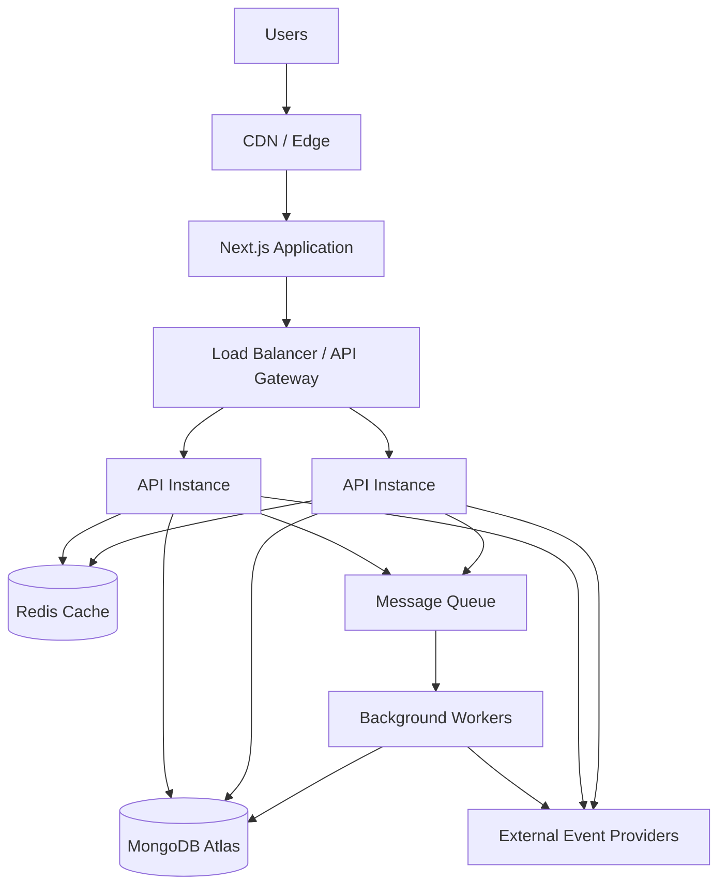

---

# 📈 Scalability Strategy

## Frontend

* Next.js server rendering
* Edge/CDN caching
* Image optimization
* Component-level code splitting

## Backend

* Stateless API instances
* Horizontal scaling
* API gateway/load balancing
* Centralized authentication strategy

## Database

* MongoDB indexes
* Query optimization
* Pagination
* Connection pooling
* Read/write separation where necessary

## Caching

A future Redis layer can cache:

```text
Popular Events
Event Details
Search Results
Session Data
Rate Limit Counters
```

## Background Processing

Use workers for:

```text
Reminder delivery
Event synchronization
Email notifications
Analytics aggregation
Recommendation generation
```

---

# 🧪 Testing Strategy

## Unit Tests

Test isolated business logic:

```text
Authentication
Event filtering
Intent classification
RSVP state transitions
Invite attribution
Reminder creation
```

## Integration Tests

Test:

```text
API + MongoDB
Authentication
Events
RSVP
Invites
Chat tools
```

## End-to-End Tests

Representative flow:

```text
Register
   ↓
Login
   ↓
Search Event
   ↓
Open Event
   ↓
RSVP
   ↓
Generate Invite
   ↓
Open Invite
   ↓
Friend RSVP
   ↓
Verify Attribution
```

---

# ⚠️ Known Limitations

The current implementation is an MVP-oriented architecture.

The following areas are candidates for production expansion:

### AI

The existing assistant uses deterministic intent routing and database tools.

A production LLM layer can be introduced for:

* Natural-language understanding
* Multi-step planning
* Tool calling
* Context-aware conversations
* Personalized recommendations

### Notifications

Reminder records exist, but a background delivery mechanism should be added.

### Event Providers

A production event ingestion architecture should support:

```text
Provider API
    ↓
Ingestion
    ↓
Normalization
    ↓
Deduplication
    ↓
MongoDB
    ↓
Search / Discovery
```

### Testing

A comprehensive automated test suite should be added before large-scale deployment.

---

# 🗺️ Roadmap

## Phase 1 — Engineering Foundation

* [ ] Comprehensive unit tests
* [ ] Integration tests
* [ ] E2E tests
* [ ] CI/CD
* [ ] Production logging
* [ ] Error monitoring
* [ ] Docker support
* [ ] Strict request validation

## Phase 2 — Event Intelligence

* [ ] External event-provider integration
* [ ] Automated event synchronization
* [ ] Event deduplication
* [ ] Event freshness management
* [ ] Advanced search

## Phase 3 — AI Assistant

* [ ] LLM-powered intent understanding
* [ ] Function/tool calling
* [ ] Conversation memory
* [ ] Multi-step event planning
* [ ] Personalized recommendations

## Phase 4 — Engagement

* [ ] Push notifications
* [ ] Email reminders
* [ ] Calendar integration
* [ ] Social recommendations
* [ ] Referral analytics dashboard

---

# 🧱 Engineering Principles

The project follows several engineering principles:

### Separation of Concerns

```text
UI
 ↓
API Client
 ↓
Routes
 ↓
Business Modules
 ↓
Data Models
 ↓
Database
```

### Modular Domain Design

Features are isolated into independently maintainable modules.

### Typed Development

TypeScript is used across the application to reduce runtime errors and improve maintainability.

### API-First Design

Frontend functionality communicates through explicit REST API boundaries.

### Extensibility

The chat tool layer is intentionally separated from the interface, providing a foundation for future AI and agent-based capabilities.

---

# 🤝 Contributing

1. Fork the repository.

2. Create a feature branch:

```bash
git checkout -b feature/your-feature
```

3. Install dependencies:

```bash
pnpm install
```

4. Implement the feature.

5. Run validation:

```bash
pnpm typecheck
pnpm lint
pnpm build
```

6. Commit:

```bash
git commit -m "feat: add your feature"
```

7. Push:

```bash
git push origin feature/your-feature
```

8. Open a Pull Request.

---

# 📝 Commit Convention

Recommended commit format:

```text
feat: add event recommendation engine
fix: prevent duplicate RSVP creation
refactor: separate event search service
docs: update API documentation
test: add invite attribution tests
chore: update dependencies
```

---

# 📊 Architecture at a Glance

```text
                         EVENTFLOW
                             │
        ┌────────────────────┼────────────────────┐
        │                    │                    │
        ▼                    ▼                    ▼
  DISCOVERY              ENGAGEMENT             AI
        │                    │                    │
        ├─ Search            ├─ RSVP              ├─ Chat
        ├─ Filters           ├─ Invites           ├─ Intent
        ├─ Calendar          ├─ Referrals         └─ Tools
        └─ Details           └─ Reminders
        │                    │                    │
        └────────────────────┼────────────────────┘
                             ▼
                        EXPRESS API
                             │
                             ▼
                          MONGODB
```

---

# 📌 Project Metadata

| Property        | Value                    |
| --------------- | ------------------------ |
| Project         | Intelli-Chat / EventFlow |
| Repository      | `arsal-nez/Intelli-Chat` |
| Architecture    | Full-Stack Monorepo      |
| Frontend        | Next.js                  |
| Backend         | Express                  |
| Database        | MongoDB                  |
| Language        | TypeScript               |
| Authentication  | JWT                      |
| Package Manager | pnpm                     |

---

# 👨‍💻 Author

## MD Arsalan

Full-Stack Developer | Data & AI Enthusiast

**GitHub:**
https://github.com/arsal-nez

**LinkedIn:**
https://www.linkedin.com/in/md-arsalan-72924a2ab/

---

# ⭐ Why This Project?

EventFlow demonstrates the architecture of a modern full-stack application by combining:

```text
Modern Frontend
      +
REST API
      +
Authentication
      +
NoSQL Data Modeling
      +
Social Workflows
      +
Conversational UX
      +
Scalable Architecture
```

The project provides a foundation that can evolve from an MVP into a production-grade event intelligence platform with real-time event ingestion, background processing, LLM-based agents, personalized recommendations, notifications, and analytics.

---

<p align="center">

### Built with TypeScript, Next.js, Express & MongoDB

</p>
